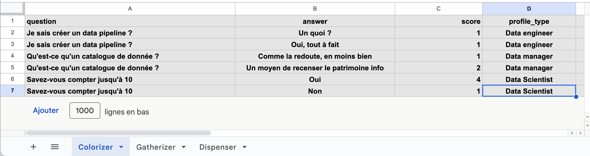
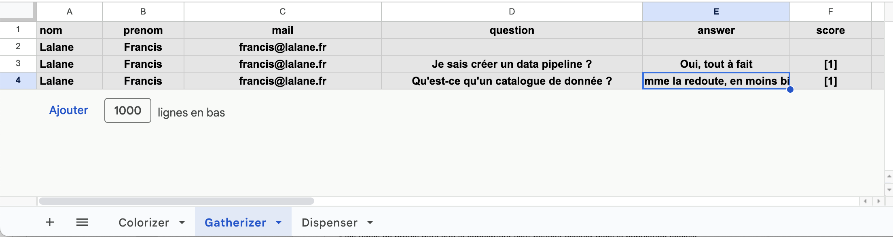
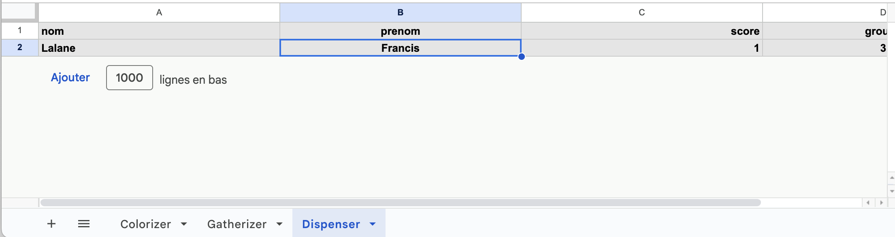

## La forge à Data Position

L'architecture est constituée : 

- d'une **base de données** qui va permettre de stocker : 

	- les critères qui vont permettre de qualifier les profils
	- les réponses de la population aux questions qui permettent de collecter les données relatives aux critères 
	- les groupes dans lesquels les membres de la population sont répartis

* d'une **application web** qui permettra au concepteur du Data Position de : 

	* créer une table de qualification des membres de la population 
	* recruter et qualifier des membres de la population via un questionnaire
	* analyser la position de tous les membres de la population et les répartir en différents groupes 

### A propos de la base de données

<b>Attention</b> : 1 Data position = 1 base de données. Il faudra donc demander la création d'une base de données à Datactivist pour pouvoir créer la base 

Il s'agit d'un Google sheet avec 3 onglets : 

- l'onglet "Colorizer" correspond à la Table de qualification et va permettre de stocker : 
	- les types de profils *data* que le concepteur veut pouvoir évaluer dans la population choisie
	- les questions posées par le concepteur du dataposition pour identifier les différentes profils *data* au sein de sa population
	- les réponses possibles pour chaque question
	- le niveau de maitrise associé à chacune des réponses 

Aperçu de l'onglet "Colorizer"

* l'onglet "Gatherizer" stocke les réponses des membres de la population aux questions qui permettent de qualifier les profils

Aperçu de l'onglet "Gatherizer"

* l'onglet "Dispenser" stocke la répartition des membres de la population en différents groupes

Aperçu de l'onglet "Dispenser"

### A propos de l'application Web 

L'application Web permet d'accéder via une seule URL à toutes les fonctionnalités du Data position. Ainsi, le concepteur pourra y : 
* créer sa table de qualification

Aperçu de l'onglet "Qualification"

* diffuser le questionnaire nécessaires pour qualifier les membres de sa population

Aperçu de l'onglet "Recrutement"

* visualiser, en fonction des réponses, la répartition par profil des membres de sa population 

Aperçu de l'onglet "Recrutement"

* dispatcher dans différents groupes les membres de sa population . 

